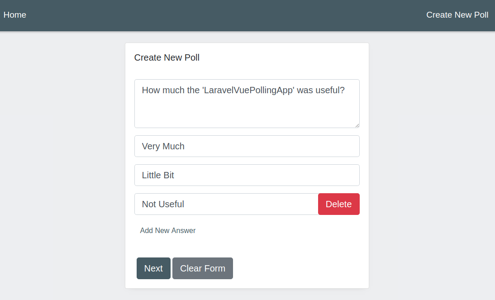
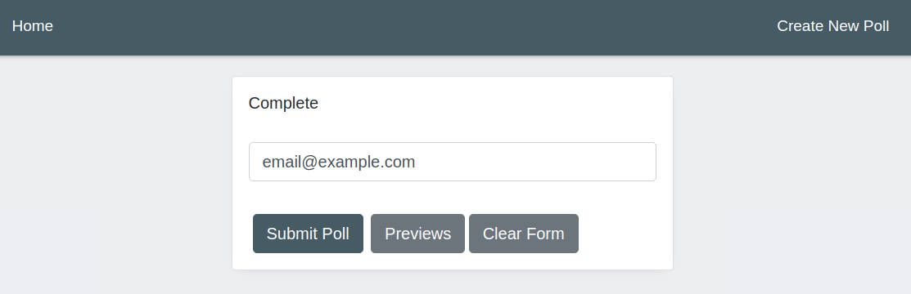
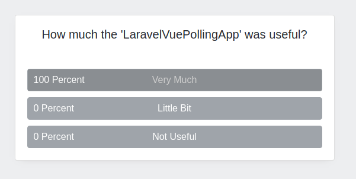
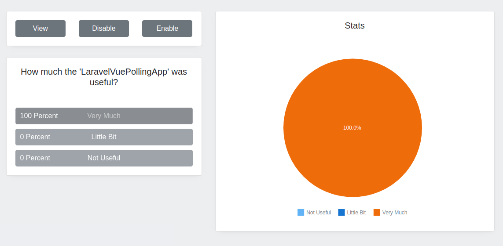

# laravel-vue-polling-app
Laravel Vue.js Polling App

A simple polling system with Laravel and Vuejs

# Built With

### Back-End

PHP 7.2, Laravel 5.7, Mysql 10.1.29-MariaDB

### Front-End

Javascript, Vue.js 2, Vue-Router, Bootstrap, Sass

# Demo

Live Demo : http://laravel-vue-polling-app.saeedvaziry.ir/

# Screenshots

### Create Poll Step 1

### Create Poll Step 2

### View Poll

### Manage Poll And See Stats

# Installation

### Back-End

- Clone the project
- Run `composer install`
- Run `php artisan migrate:refresh --seed`
- Run `php artisan serve` to serve application on `localhost:8000`

### Front-End

- Run `npm install`
- Run `npm run watch` to watch and develop
- Run `npm run production` to build project and use in production

## License

This repo is open-sourced software licensed under the MIT license.
